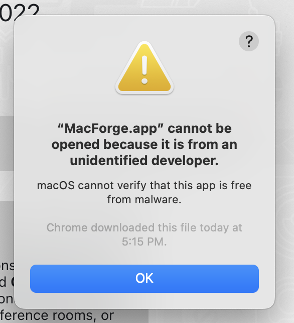

Disable SIP with `csrutil disable`. The M1 steps for this are different from Intel, you no longer use Command+R. See https://eshop.macsales.com/blog/74502-boot-an-m1-mac-into-recovery-mode/.

Confirm once you're rebooted that it's turned off with `csrutil status`.

Download the latest MacForge Beta. I used this link: https://github.com/MacEnhance/appcast/raw/master/Beta/MacForge/MacForge.1.2.0B1.zip. It came from the pinned message in the MacForge Beta channel of the MacEnhance discord: https://discord.gg/rzbmJ62a.

<p align="center">
  <br>
  <i>When opening, this will popup</i>
</p>

Click OK and then "Apple Icon > System Preferences > Security and Privacy" > "General" tab and click "Open Anyway". Follow some of the steps (screenshots attached).

Forget to disable Library Validation.

```
sudo defaults write /Library/Preferences/com.apple.security.libraryvalidation.plist DisableLibraryValidation -bool true
```

Restart the computer.

Building this immediately kills Dock. You can get out of this with Terminal.

```
cd /Library/Application Support/MacEnhance/Plugins
rm -rf spaces-renamer.bundle
killall -9 Dock
```

Looking at console
no matching executable architecture found for loading : com.alexbeals.spaces-renamer into com.apple.dock (3315)

System Policy: symptomsd(534) deny(1) system-privilege 10006
MacOS error: -67028

```
security error -67028
Error: 0xFFFEFA2C -67028 bundle format unrecognized, invalid, or unsuitable
```

From here:
https://github.com/MacEnhance/MacForge/blob/53885f7c48c38f5ca7cac24f49ba06fcd2b1f0ad/MacForge/MacForgeHelper/MFAppDelegate.m#L626-L641

I think something is just truly malformed about my bundle build stuff now.

Have to break LetsMove dependency because of arm64 stuff, might use AppMover - https://github.com/OskarGroth/AppMover. For now, just delete it.

In the configureObservers function of the SpacesRenamer I can use this code to determine what the executable architectures are for the built bundle. This returns `16777223, 16777228` which is...unclear.
com.apple.dock is `16777228`. Which DOES feel like it should work.

```
let bundle = Bundle(path: "/Users/abeals/Git/spaces-renamer/build/spaces-renamer/spaces-renamer.bundle")
NSLog("hackingdartmouth - \(String(describing: bundle?.executableArchitectures))")
let app = NSRunningApplication.runningApplications(withBundleIdentifier: "com.apple.dock")[0]
NSLog("hackingdarmtouth - \(app.executableArchitecture)")
```

arm64 is m1 -> 16777228
x86_64 is intel

As of 7/31/22 asked https://discord.com/channels/608740492561219617/804044537432506439/1003495370615173160 to see if the Beta build I'm using is most up to date, because the error code from injecting isn't in that branch.

> as the Beta compatible build from the pinned task, but the error logs are citing "no matching executable architecture found for...". That error message is only in the master branch for MacForge, it's deleted in the @jslegendre  fix-beta branch. Does the MacForge.1.2.0B1.zip file have the most up-to-date MacForgeHelper or am I somehow installing it wrong?

> I tried building the branch locally, but was hitting ld: framework not found Pods_com_macenhance_MacForge_Injector. First time going through the Brew/CocoaPods install setup on an M1 though, so I may have done something wrong.
