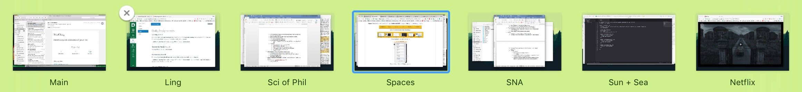

# Spaces Renamer

Spaces Renamer is a combination of an application and SIMBL plugin to allow you to rename your spaces.

   
  <i>The compressed view after pressing F3</i>

   
  <i>The expanded view after hovering</i>

   
  <i>The interface for renaming the spaces</i>

Spaces Renamer supports multiple monitors, and highlights the current space in each monitor with an outline.  Here it is [in a video](https://vimeo.com/264878100) if you want to see it in action.

### The Problem
I want to be able to rename my spaces.  While TotalSpaces has this functionality, it's not free, and it has a bunch of other features that I'm not really interested in.

### The Solution
This is a SIMBL plugin and an application.  The SIMBL plugin handles renaming spaces from a saved plist.  The application adds an icon to the status bar that allows you to rename the spaces and update the plist.

## Installation:
1. Download [mySIMBL](https://github.com/w0lfschild/app_updates/raw/master/mySIMBL/mySIMBL_0.2.5.zip).
2. Download [Spaces Renamer](https://github.com/dado3212/spaces-renamer/raw/master/build/spaces-renamer.zip).
3. Unzip the downloaded .zip file.
4. Open `spaces-renamer.bundle` with `mySIMBL.app`, or simply drag and drop it.
5. Run `killall -9 Dock` in Terminal to restart the Dock application.
6. Run the application 'SpacesRenamer'.
