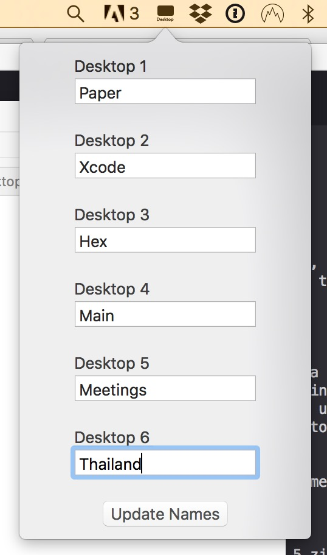

<h1 align="center">
  
  
Spaces Renamer

</h1>

Spaces Renamer is a combination of an application and SIMBL plugin to allow you to rename your spaces.

   
  <i>The compressed view after pressing F3</i>

   
  <i>The expanded view after hovering</i>

   
  <i>The interface for renaming the spaces</i>

Spaces Renamer supports multiple monitors, and highlights the current space in each monitor with an outline.  Here it is [in a video](https://vimeo.com/264878100) if you want to see it in action.

### The Problem
I want to be able to rename my spaces.  While TotalSpaces has this functionality, it's not free, and it has a bunch of other features that I'm not really interested in.

### The Solution
This is a SIMBL plugin and an application.  The SIMBL plugin handles renaming spaces from a saved plist.  The application adds an icon to the status bar that allows you to rename the spaces and update the plist.

## Installation:
<ol>
  <li>Download <a href="https://www.macenhance.com/macforge?macforge://github.com/w0lfschild/macplugins/raw/master/com.alexbeals.SpacesRenamer">MacForge</a>, the newest incarnation of mySIMBL.
    <ul><li>If it's not compatible, you can download the <a href="https://github.com/w0lfschild/mySIMBL/releases/latest">latest mySIMBL version</a>.</li></ul>
  </li>
  <li>
    Make sure that it's installed, including disabling SIP (use the command <code>csrutil disable</code> in Recovery mode by <a href="https://www.imore.com/how-turn-system-integrity-protection-macos">following this tutorial</a>).  There are additional commands for macOS Catalina, with details under the 'System' tab of MacForge.  After it's installed you can partially re-enable SIP using <code>csrutil enable --without debug --without fs</code>. If you fully enable SIP, Spaces Renamer won't work.
  </li>
  <li>
    Download <a href="https://github.com/dado3212/spaces-renamer/raw/master/build/spaces-renamer.zip">Spaces Renamer</a>.
  </li>
  <li>
    Unzip the downloaded .zip file.
  </li>
  <li>
    Open <code>spaces-renamer.bundle</code> with <code>MacForge.app</code>, or simply drag and drop it in to install it.
  </li>
  <li>
    Run <code>killall -9 Dock</code> in Terminal to restart the Dock application.
  </li>
  <li>
    Run the application 'SpacesRenamer'.  Accept the option to move it to /Applications.  It should be automatically added to your Login Items, but you can check to confirm by going to "System Preferences" > "Users & Groups" > "Login Items" and adding it manually if necessary.
  </li>
  <li>
    Open the 'Spaces Renamer' icon in the top bar and click 'Update Names' (doesn't matter what's in there).  Otherwise the top bar may not appear!
  </li>
  </ol>

--- 

Donations [are always appreciated](https://www.paypal.com/paypalme2/AlexBeals), but in no way expected.
